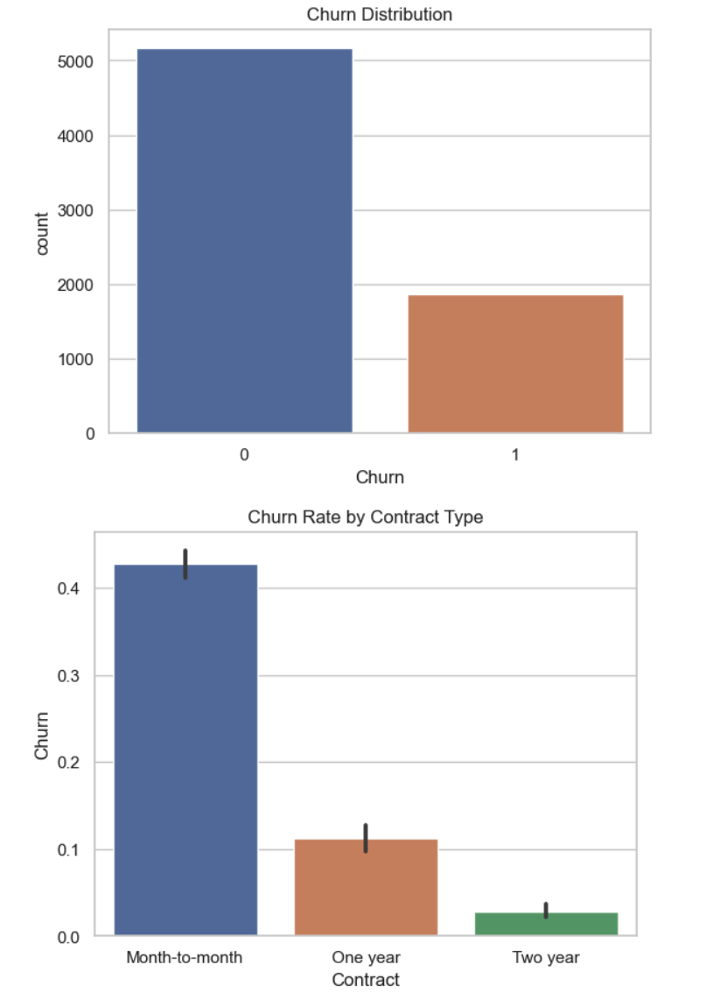
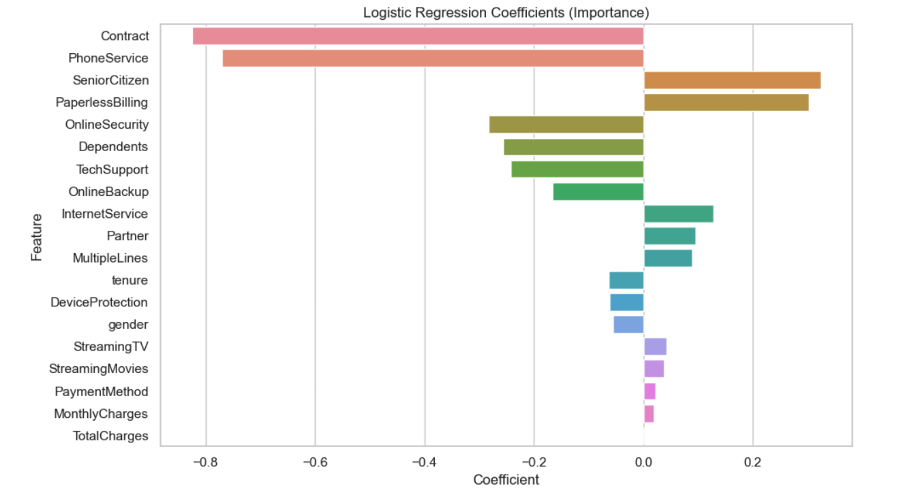
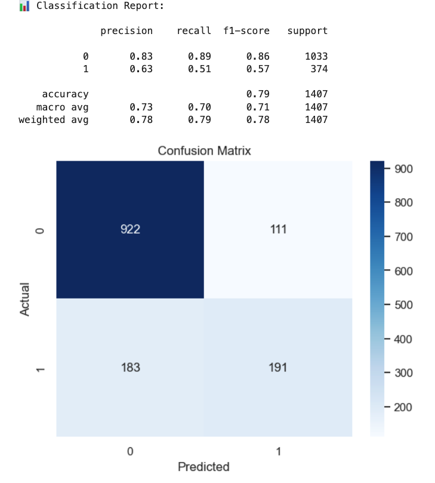

# 🔁 Customer Churn Analysis

This project analyzes customer churn using a real-world telecom dataset. The goal is to identify the drivers of churn and build a predictive model to flag high-risk customers. The project combines data cleaning, exploratory analysis, and classification modeling using logistic regression.

---

## 🚀 Overview

Customer churn is a key business metric for subscription-based companies. By analyzing behavioral and contractual data, this project helps business teams understand who is likely to churn — and why.

---

## 📌 Key Features

- Cleaned and prepared telecom churn dataset (7,000+ records)
- EDA of churn trends across contract types, charges, and services
- Logistic regression model with performance evaluation
- Feature importance analysis for business decision support

---

## 📁 Project Structure

```
customer-churn-analysis/ 
├── churn_data.csv # Source dataset 
├── churn_eda_model.ipynb # Jupyter notebook with EDA + model 
├── images/ 
│ └── churn_plots.png # Screenshots for portfolio/README 
└── README.md # This file
```

---

## 🧠 Tools Used

- Python, Pandas, Matplotlib, Seaborn
- scikit-learn (modeling + evaluation)
- Jupyter Notebook

---

## 🛠️ How to Run

1. Clone the repo or download the files  
2. Install required packages:

   ```bash
   pip install pandas matplotlib seaborn scikit-learn
   ```
   ```bash
   churn_eda_model.ipynb
   ```





This project reflects my experience in understanding customer behavior through data. It demonstrates my ability to translate business problems into machine learning workflows that support decision-making.

