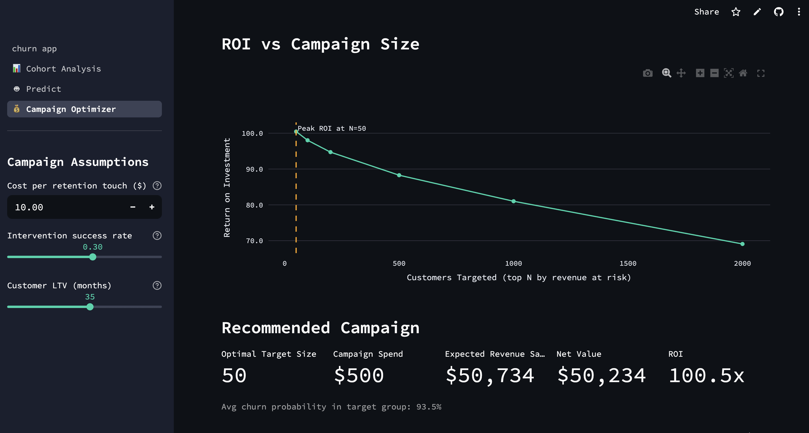

# Churn Edge

**AI-powered customer churn prediction with revenue-at-risk scoring and Claude-generated retention recommendations.**

[](https://python.org)
[](LICENSE)
[](https://hetron-customer-churn-analysis.streamlit.app)

## Demo



The Campaign Optimizer page scores every customer in the dataset, ranks them by annualised revenue at risk, sweeps campaign size against ROI, and surfaces the optimal top-N to target given your retention cost and intervention success rate.

**[Try the live app →](https://hetron-customer-churn-analysis.streamlit.app)**

## Features

- Interactive cohort EDA — churn rate by contract type, tenure, charges, services, and payment method
- LightGBM classifier with `class_weight="balanced"` for accurate minority-class prediction
- Stratified 5-fold cross-validation — true out-of-sample AUC, F1, precision, recall, log-loss
- 9 engineered features beyond raw columns: `tenure_bucket`, `services_count`, `has_security_addon`, `has_streaming`, `avg_charge_per_month`, `charge_vs_monthly_ratio`, `is_month_to_month`, `is_auto_pay`, `is_fiber`
- Plotly interactive visualisations — dark AIBC theme, teal accent
- Claude Sonnet explains each customer's churn risk in plain English and recommends a retention action
- **Revenue-at-risk scoring** — `expected_loss = MonthlyCharges × churn_proba × 12` per customer
- **ROI-optimised retention campaign sizing** — sweep campaign size → ROI curve → optimal top-N recommendation

## How it works

```
IBM Telco CSV (7,043 customers)
  └─► Clean
        Coerce TotalCharges · drop 11 blank rows · map Churn Yes/No → 1/0
  └─► Engineered Features (9 new signals)
        tenure_bucket · services_count · has_security_addon · has_streaming
        avg_charge_per_month · charge_vs_monthly_ratio
        is_month_to_month · is_auto_pay · is_fiber
  └─► One-hot encoding → feature matrix
  └─► LightGBM Classifier
        class_weight=balanced · 300 estimators · depth 6
  └─► Stratified 5-fold Cross-Validation
        AUC · Accuracy · Precision · Recall · F1 · Log-loss per fold
        Out-of-fold probabilities for honest downstream ranking
  └─► Claude Explanation (Sonnet)
        Customer profile + top risk factors → plain-English retention rec
  └─► Revenue-at-risk scoring
        Expected loss = MonthlyCharges × churn_proba × 12 per customer
  └─► Campaign Optimizer
        Sweep campaign size → ROI curve → optimal top-N recommendation
```

## Tech stack

| Layer | Tech |
|---|---|
| UI | Streamlit |
| Model | LightGBM |
| Features | pandas, numpy, scikit-learn |
| Dataset | IBM Telco Churn (public) |
| Explanation | Claude Sonnet (Anthropic API) |
| Viz | Plotly |
| Tests | pytest |

## Local setup

```bash
git clone https://github.com/HeTron/customer-churn-analysis.git
cd customer-churn-analysis
python -m venv .venv && source .venv/bin/activate
pip install -r requirements.txt

cp .env.example .env
# Edit .env — add ANTHROPIC_API_KEY (optional; app works without it)

streamlit run churn_app.py
```

Open `http://localhost:8501`.

## Tests

```bash
pytest tests/
```

## Environment variables

| Variable | Required | Notes |
|---|---|---|
| `ANTHROPIC_API_KEY` | No | Predict and Campaign Optimizer pages work without it; only the Claude retention explanation becomes unavailable |

## Disclaimer

This is a portfolio project using the public IBM Telco churn dataset. Not for production use without retraining on real customer data and validating against your own KPIs and business definitions of churn.
